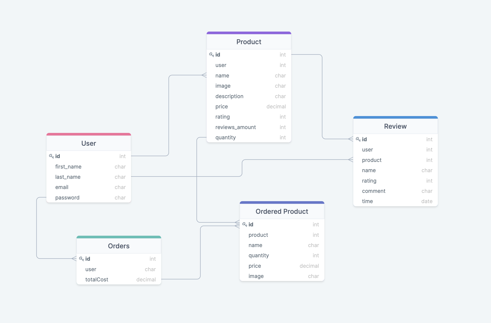
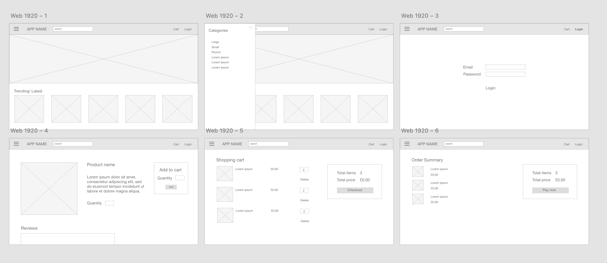
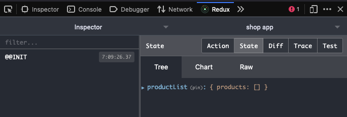
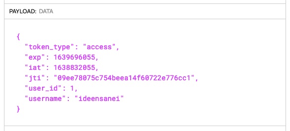
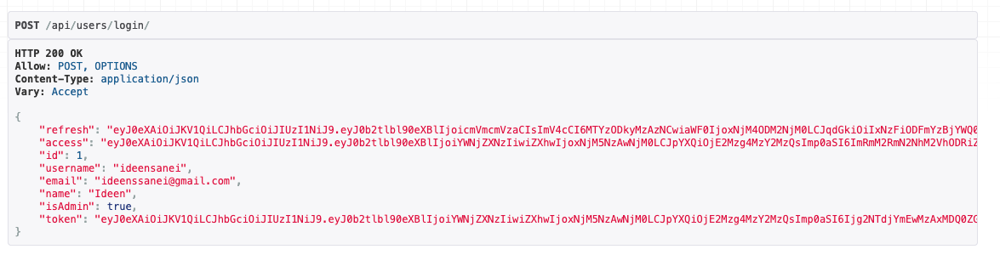

# Artisan


## Overview
This was the fourth and final project in the General Assembly course and was taken on as a solo project. 

Artisan is an e-commerce site based around my own art, with a focus on the cart and checkout process. A user can browse products on the application and add items to their cart, but they must be logged in to proceed to checkout. A regular customer cannot edit or delete any products, but an admin user can edit products, delete users, and view orders.

My main aim for this project was to create a clean and easy-to-use site while also implementing Redux for global state management. This was a particularly interesting journey for me as Redux was not covered in the syllabus and so I had to conduct independent research and learning in order to successfully use it.


## Brief
Create a full-stack application with a React frontend and a Django backend, as well as a fully functional RESTful API with all CRUD routes. Include at least one one-to-many and one many-to-many relationship. Custom authentication (register / login) is optional.

## Deployment
Please click [here](https://shop-app-frontend.herokuapp.com) view the deployed project. The application is deployed on Heroku so please give the server a few moments to warm up!

## Technologies
- JavaScript
- React
- Redux
- Python
- Django
- Django Rest Framework
- PostgreSQL
- CSS
- React Bootstrap
- Pip3
- Yarn
- Git
- GitHub
- Pillow
- JWT
- Heroku
- Adobe XD

## Getting Started
- Clone or download the project repo
- In the project root run `python manage.py runserver`
- In the frontend run `yarn start`
- Find the project at `http://localhost:3000` in your browser

## Approach
The project began with some planning of endpoints, relationships, and the application in general. To prepare, I created an Entity Relationship Diagram and a wireframe.

#### ERD


#### Wireframe


#### MVP
- E-commerce site with admin capabilities for CRUD routes
- Functional cart
- Search for items
- Reviews and ratings for products
- Authentication to purchase and to leave a review

#### Extra features
- Paypal API integration
- Product categories to browse

The first step I took after the initial preparation was creating the models in the backend with the help of my ERD diagram for guidance. This was a relatively simple step as I had planned it beforehand, although by the end of the project there were some fields that I did not end up using.

### Redux
I then turned my attention to setting up Redux, as well as the Redux DevTools so that I could see when actions were triggered in the browser as well as the current states. This was particularly useful for testing and debugging throughout the project.



From here I created a ‘store’ file that holds the global state of the application as well as an ‘action’ and ‘reducer’ file for products, users, and orders. The store was never directly modified and all state updates were made through actions that were then dispatched to the store. The reducer functions I created then calculated the new state and updated the application accordingly.

### Authentication
As I was using the Django Rest Framework, I was able to use the Simple JWT authentication plugin (documentation [here](https://django-rest-framework-simplejwt.readthedocs.io/en/latest/customizing_token_claims.html)) that does not require a database to validate a token. I was also able to use custom views to then return data from the token.

I used jwt.io to test my custom token claims and wrote them to provide information such as the username and email of the user to make the login process easier in the frontend.





Here is the user login action using an Axios request and setting the dispatch to store the user info for future use.
```
export const login = (email, password) => async (dispatch) => {
 try {
   dispatch({
     type: USER_LOGIN_REQUEST,
   })
   const config = {
     headers: {
       'Content-type': 'application/json',
     },
   }
   const { data } = await axios.post(
     `${process.env.REACT_APP_BASE_URL}/api/users/login/`,
     {
       username: email,
       password: password,
     },
     config
   )
   dispatch({
     type: USER_LOGIN_SUCCESS,
     payload: data,
   })
   localStorage.setItem('userInfo', JSON.stringify(data))
 } catch (error) {
   dispatch({
     type: USER_LOGIN_FAIL,
     payload:
       error.response && error.response.data.detail
         ? error.response.data.detail
         : error.message,
   })
 }
}
```
In the frontend the user can log in if they have an account or be redirected to the register page if not.


A user that is not logged in can only view products and add them to their cart, however they are prompted to log in before proceeding with the checkout process. This is so that the order is attached to the user and therefore can access the user's information. The user also cannot leave reviews unless logged in.


A customer (regular user) can write reviews and checkout their cart items, but only an admin user can edit products and view orders. Below is a demo of what an admin user will be able to see in the frontend:


## Wins
- Time management: Being able to complete my MVP within a week was a huge win as this was a solo project, and I was continuing to learn and explore during the process.
- Styling: I was very pleased with my use of React Bootstrap to efficiently style the application into a professional and commercial looking site. All my styling was also done throughout the project which was a lot more tidy and organised for me.

## Challenges
The biggest challenge in this project was using Redux. For such a small project, Redux was perhaps not the most useful as it required a lot of additional code and extra learning for only a small amount of functionality. However, I do understand its use case in larger, more complex projects where there are lots of areas where state is needed or updated frequently.

A more specific challenge in the backend arose when certain pieces of information were not being serialized correctly, particularly the shipping information. When sending the request, the data returned as false and so I was unable to populate the checkout pages with the address. To overcome this I used the data from the order page instead, reusing that request to populate the page with the correct information.

Another challenge I had was integrating the Paypal API with the application. Although the Paypal popup does appear, and a payment can be made to a sandbox account, there are numerous errors that prevent the following state to be changed. I was unable to rectify this but it is definitely a future addition to the project.

## Future features
One feature that I had as a part of my MVP that I did not include was a search bar. I did not include this because it did not make sense in my site as there were not many products and therefore not much reason to search as they were all displayed on the home page.

A related feature is seeding a database full of products. I would have liked to have done this as, if the range of products was much larger, it would have been much more difficult and more time consuming to add individual products via the Django admin panel. Seeding in data is a more practical solution that I will most probably use in the future.

## Key learnings
The most important thing I learned from this project was more strict time management. This is because I had a considerable amount to learn before even beginning to code and could have taken a lot more of my time if I did not have a set schedule. Because of this, I was able to complete most of the MVP in the given time.

Another skill I strengthened during this project was debugging. Although it was difficult trying to solve bugs in a technology that I was quite new to, using tools such as Redux DevTools helped solve issues, as well helping to increase my understanding of Redux.

